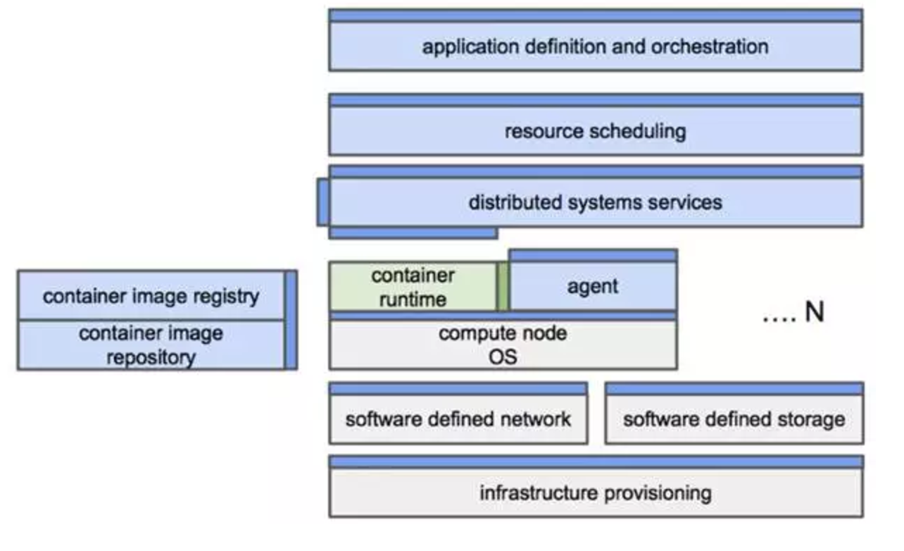

#  云原生架构

#  云原生生态

#  相关社区和厂商
##  应用程序定义和开发
### 语言和框架
- [Golang](https://github.com/golang)
- [React](https://github.com/facebook/react)
- [Nodejs](https://github.com/nodejs)
- [Rails](https://github.com/rails)
- [Php](https://github.com/php)
- [Python](https://github.com/python)
- [Spring](https://github.com/spring-projects)

### 数据
- [PostgreSQL](https://github.com/postgres)
- [MySQL](https://github.com/mysql)
- [Kafka](https://github.com/apache/kafka)
- [CockroachDB](https://github.com/cockroachdb)
- [MongoDB](https://github.com/mongodb)
- [Redis](https://github.com/antirez/redis)
- [Spark](https://github.com/apache/spark)
- [HERON](https://github.com/twitter/heron)
- [NATS](https://github.com/nats-io)

### 源码管理
- [GitHub](https://github.com/)
- [GitLab](https://github.com/gitlabhq)
- [Bitbucket](https://bitbucket.org/)

### 应用定义
- [Packer](https://github.com/mitchellh/packer)
- [Docker-Compose](https://github.com/docker/compose)
- [Habitat](https://github.com/habitat-sh)

### 注册服务
- [Docker-Registry](https://github.com/docker/distribution)
- [Quay](https://github.com/coreos/quay-docs)
- [JFrog Artifactory](https://github.com/JFrogDev)
- [Atomic](https://github.com/projectatomic/atomic)

###  CI/CD
- [Jenkins](https://github.com/jenkinsci)
- [Travis CI](https://travis-ci.org/)
- [Circleci](https://circleci.com/)

###  第三方API
- [Twilio](https://www.twilio.com/)
- [Stripe](https://stripe.com/)
- [Segment](https://segment.com/)
- [Auth0](https://auth0.com/)

##  编排和管理
### 调度和编排
- [Kubernetes](https://github.com/kubernetes)
- [Mesos](https://github.com/apache/mesos)
- [Swarm](https://github.com/docker/swarm)
- [Nomad](https://github.com/hashicorp/nomad)
- [AWS ECS](https://aws.amazon.com/ecs/)

### 协调和服务发现
- [ETCD](https://github.com/coreos/etcd)
- [ZooKeeper](https://github.com/apache/zookeeper)
- [Consul](https://github.com/hashicorp/consul)
- [DNS](https://zh.wikipedia.org/zh-hans/%E5%9F%9F%E5%90%8D%E7%B3%BB%E7%BB%9F)

### 服务管理
- [Nginx](https://github.com/nginx)
- [GRPC](https://github.com/grpc)
- [Linkerd](https://github.com/BuoyantIO/linkerd)
- [Buoyant](https://github.com/BuoyantIO)
- [Weaveflux](https://github.com/weaveworks/flux)
- [Envoy](https://github.com/lyft/envoy)
- [Traefik](https://github.com/containous/traefik)

##  运行时环境
### 云原生存储
- [AWS S3](https://aws.amazon.com/cn/documentation/s3/)
- [ClusterHQ](https://github.com/ClusterHQ/)
- [GlusterFS](https://github.com/gluster/glusterfs)
- [SolidFire](https://www.solidfire.com/)
- [Ceph](https://github.com/ceph)
- [Diamanti](https://diamanti.com/)
- [Minio](https://github.com/minio)
- [Portworx](https://github.com/portworx)
- [EMC](https://www.emc.com/zh-cn/index.htm)
- [REX-Ray](https://github.com/codedellemc/rexray)
- [libStorage](https://github.com/codedellemc/libstorage)

### 容器运行时
- [Docker](https://github.com/docker/docker)
- [Rkt](https://github.com/coreos/rkt)
- [Open Container Initiative](https://www.opencontainers.org/)

### 云原生网络
- [VPC](https://en.wikipedia.org/wiki/Virtual_private_cloud)
- [TiGERA](https://github.com/tigera)
- [Canal](https://github.com/tigera/canal)
- [Calico](https://github.com/projectcalico/calico)
- [Docker libnetwork](https://github.com/docker/libnetwork)
- [Open Contrail](https://github.com/Juniper/contrail-controller)
- [Flannel](https://github.com/coreos/flannel)
- [Open vSwitch](https://github.com/openvswitch/ovs)
- [Weave Net](https://github.com/weaveworks/weave)
- [Romana](http://romana.io/)

##  配置管理

### 基础设施自动化
- [BOSH](https://github.com/cloudfoundry/bosh)
- [Terraform](https://github.com/hashicorp/terraform)
- [CloudFormation](https://aws.amazon.com/cn/cloudformation/)

### 主机管理
- [Ansible](https://github.com/ansible)
- [Chef](https://github.com/chef)
- [SaltStack](https://github.com/saltstack)
- [Puppet](https://github.com/puppetlabs/puppet)

### 安全镜像
- [Clair](https://github.com/coreos/clair)
- [Twistlock](https://www.twistlock.com/)
- [Docker Security](https://github.com/docker/docker-bench-security)

##  基础设施
- [Amazon Web Services](https://aws.amazon.com/cn/)
- [Google Cloud Platform](https://cloud.google.com/)
- [Microsoft Azure](https://azure.microsoft.com/zh-cn/)
- [IBM Bluemix](https://www.ibm.com/cloud-computing/bluemix/)
- [DigitalOcean](https://www.digitalocean.com/)
- [OpenStack](https://github.com/openstack)
- [Vmware](http://www.vmware.com/)

##  平台
- [Openshift](https://www.openshift.com/)
- [Docker Datacenter](https://www.docker.com/products/docker-datacenter)
- [CloudFoundry](https://www.cloudfoundry.org/)
- [DC/OS](https://dcos.io/)
- [Tectonic](https://tectonic.com/)
- [DEIS](http://deis.io/)
- [Rancher](http://rancher.com/)
- [Vmware Photon Platform](https://www.vmware.com/products/photon-platform.html)
- [TRITON](https://www.joyent.com/datacenter)
- [Apprenda](https://apprenda.com/)
- [Platform9](https://platform9.com/)
- [MANTL](https://mantl.io/)
- [Flynn](https://flynn.io/)
- [APCERA](https://www.apcera.com/)

##  观察和分析
### 性能监控
- [New Relic]()
- [App Dynamics]()
- [DataDog]()
- [Sysdig]()
- [Weave]()
- [WeveFront]()
- [SignalFx]()
- [Prometheus]()
- [LightStep]()

### 日志管理
- [Splunk]()
- [Elastic]()
- [Fluentd]()

### 追踪定位
- [OpenTracing]()
- [ZIPKIN]()